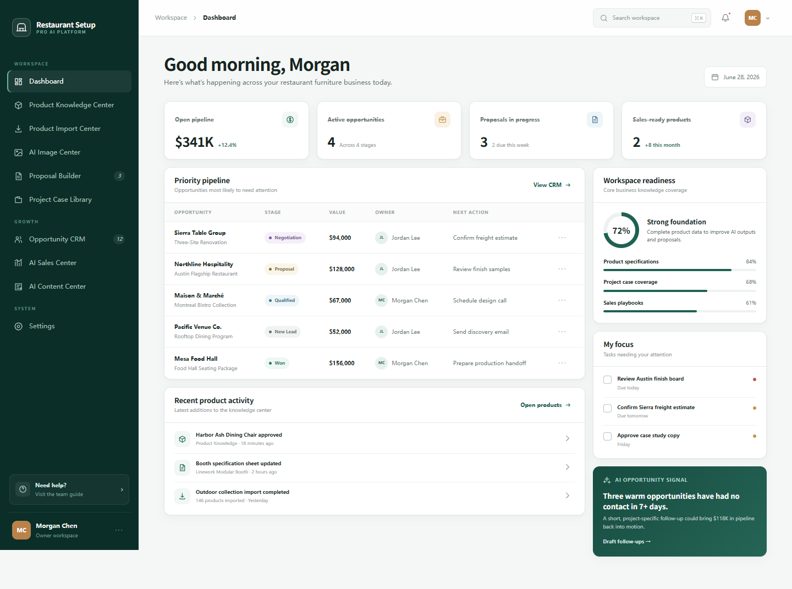

# Module 01 Development Report

Project: **Restaurant Setup Pro AI Platform**  
Report date: **June 28, 2026**  
Scope: Module 01 — foundational internal platform, authentication, navigation, RBAC, database foundation, and deployable application shell.

> The repository now also contains the later multilingual enhancement (`public/i18n.js` and `public/locales/`). Those files are shown in the current directory tree but are not counted as original Module 01 scope.

## 1. Project directory structure

```text
restaurant-setup-pro-ai-platform/
├── database/
│   └── schema.sql                 # Relational database schema
├── public/
│   ├── locales/
│   │   ├── en.js                  # English interface resource
│   │   └── zh-CN.js               # Chinese interface resource
│   ├── app.js                     # Browser application, routes, and module views
│   ├── favicon.svg                # Product favicon
│   ├── i18n.js                    # Internationalization runtime
│   ├── index.html                 # Application shell and login view
│   └── styles.css                 # Responsive design system
├── src/
│   └── server.mjs                 # HTTP service, auth, RBAC, APIs, static hosting
├── tests/
│   ├── i18n.test.mjs              # Locale coverage tests
│   └── integration.test.mjs       # Authentication, APIs, and permission tests
├── outputs/
│   └── restaurant-setup-pro-dashboard.png
├── work/                          # Internal QA helpers; not production runtime
├── .dockerignore
├── .env.example
├── .gitignore
├── Dockerfile
├── package.json
└── README.md
```

Generated runtime data is stored in `data/restaurant-setup-pro.db` and ignored by Git.

## 2. Technology stack

| Layer | Technology | Notes |
| --- | --- | --- |
| Front end | HTML5, CSS3, browser JavaScript ES modules | Responsive single-page internal workspace; no front-end framework dependency |
| Back end | Node.js 24, native `node:http` | REST-style JSON endpoints and static asset hosting |
| Database | SQLite via native `node:sqlite` | Local/cloud single-instance database with foreign keys, WAL, and indexes |
| Authentication | `scrypt`, secure random sessions, HTTP-only cookies | SameSite session cookie, expiry, disabled-user checks, audit log |
| Authorization | Server-side RBAC | Admin, Owner, Sales, Designer, and VA module permissions |
| Deployment | Docker, environment variables, health endpoint | Cloud-ready single-container deployment |
| Testing | Node.js built-in test runner | Integration, access-control, database field, and locale coverage tests |

The application has **no third-party runtime packages**.

## 3. Database design

Database definition: `database/schema.sql`

### Identity and security

| Table | Purpose |
| --- | --- |
| `users` | Team members, roles, account status, password hash, and login metadata |
| `sessions` | Server-side login sessions with expiry |
| `audit_log` | Security and business action audit records |

### Product knowledge

| Table | Purpose |
| --- | --- |
| `product_categories` | Product taxonomy |
| `products` | SKU, product name, material, size, price range, lead time, MOQ, tags, and status |
| `product_documents` | Product specifications and supporting files |
| `import_jobs` | Spreadsheet/CSV import jobs and validation results |

### Sales and proposals

| Table | Purpose |
| --- | --- |
| `opportunities` | Company, project, market, stage, probability, estimated value, owner, and next action |
| `opportunity_activities` | Opportunity timeline and activity notes |
| `proposals` | Proposal number, client, project, market, status, owner, and validity |
| `proposal_items` | Products and quantities associated with a proposal |

### Content and project knowledge

| Table | Purpose |
| --- | --- |
| `project_cases` | Completed hospitality project case studies |
| `ai_images` | AI image prompts, outputs, styles, and workflow status |
| `content_assets` | Content ideas, drafts, channels, schedules, and ownership |
| `organization_settings` | Organization-level configuration values |

### Main relationships

- Users own products, imports, proposals, opportunities, cases, images, content, and audit events.
- Products belong to categories and can have many documents.
- Proposals contain many proposal items; items may reference products.
- Opportunities contain many activity records.
- Foreign keys use cascade or null-on-delete behavior according to record ownership needs.
- Indexes cover sessions, product categories, opportunity stages/owners, proposal owners, and content owners.

## 4. Page screenshot



The screenshot shows the Module 01 desktop dashboard: left navigation, role-aware account area, business metrics, opportunity pipeline, readiness summary, tasks, product activity, and AI opportunity signal.

## 5. Completed functionality

- Working team-member login with password hashing and server-side sessions.
- Five roles: Admin, Owner, Sales, Designer, and VA.
- Server-enforced permission checks and role-aware left navigation.
- Sales users are restricted to their own opportunities and proposals.
- All ten requested internal modules appear in the workspace navigation.
- Responsive desktop/mobile application shell and professional U.S. B2B visual style.
- Dashboard metrics, pipeline, task, readiness, and product-activity views.
- Representative page frameworks for product knowledge, imports, AI images, proposals, cases, CRM, AI sales, AI content, and settings.
- Foundational SQLite database with relationships, indexes, demo accounts, and seed business data.
- Role access matrix in Settings.
- Search command panel, notifications, profile menu, responsive mobile sidebar, and basic UI interactions.
- Dockerfile, health endpoint, environment example, persistent database volume support, and automated tests.
- Explicitly excludes shopping cart, online payment, and customer-facing accounts.

Current automated result: **7 tests passed**.

## 6. Not yet completed

The following areas are page/workflow foundations rather than production-complete modules:

- Full create/edit/delete forms and validation for products, opportunities, proposals, cases, users, and content.
- Real spreadsheet parsing, file upload, object storage, import mapping, and error correction workflow.
- Live AI provider integration for image generation, sales assistance, recommendations, and content generation.
- Full proposal editor, line-item calculations, approval workflow, and customer PDF generation.
- CRM write operations, reminders, activity timeline editing, and email/calendar synchronization.
- Project case media uploads and reusable asset management.
- Team invitation email, password reset, MFA, SSO, and account administration workflows.
- User-facing audit log viewer and organization settings editor.
- Production infrastructure such as managed PostgreSQL, shared sessions, cloud object storage, backups, monitoring, and secrets management.
- Formal security review, load test, disaster recovery procedure, and production deployment pipeline.

The absence of payments, carts, and customer portal accounts is intentional and not an unfinished item.

## 7. README summary

- Runtime requirement: Node.js 24 or newer.
- No package installation is required for application dependencies.
- Default local address: `http://localhost:3000`.
- Demo password: `Welcome123!`.
- `SEED_PASSWORD` should be set before creating a production database.
- `/api/health` is available for deployment health checks.
- Docker deployments should persist `/app/data`.
- Demo accounts must be changed or disabled before production exposure.

See the separate `Module-01-README.md` deliverable for commands and demo accounts.

## 8. Local startup

### Standard startup

```bash
npm start
```

Open:

```text
http://localhost:3000
```

### Development mode

```bash
npm run dev
```

### Run on port 4173 in PowerShell

```powershell
$env:PORT = "4173"
npm start
```

Open:

```text
http://localhost:4173
```

### Tests

```bash
npm test
```

### Docker

```bash
docker build -t restaurant-setup-pro .
docker run --rm -p 8080:8080 \
  -e SEED_PASSWORD='replace-with-a-strong-password' \
  -v rspro-data:/app/data \
  restaurant-setup-pro
```

Open `http://localhost:8080`.

