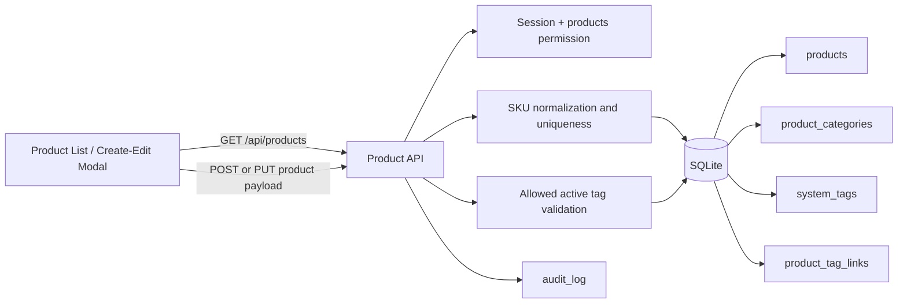
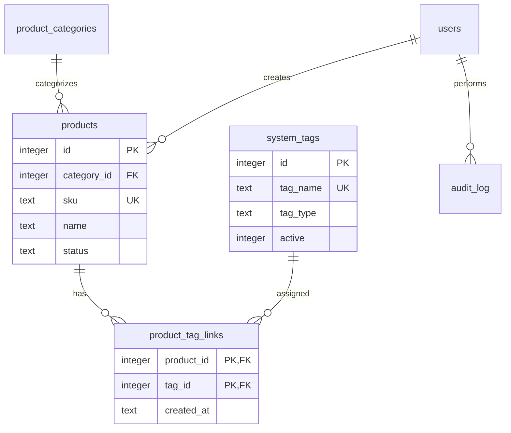

# Module 03 Architecture

## Architecture Change Summary

Architecture Changes: **Yes**

Module 03 changes the product domain from a flat text-tag model to a normalized product/tag relationship and adds a transactional product mutation boundary. It does not replace the existing single-process Node.js, SQLite, RBAC, or browser application architecture.

## Component Flow

## Data Model

## SKU Generation Boundary

1. The client provides category and SKU style and may provide a manually edited SKU.
2. The server normalizes a supplied SKU to uppercase.
3. If SKU is omitted, the server maps category/style to a prefix and finds the highest matching numeric suffix.
4. The server generates the next three-digit sequence.
5. A case-insensitive database unique index provides the final uniqueness guarantee.
6. Create/update and tag-link replacement run in one SQLite transaction.

## Tag Boundary

- The product API accepts tag IDs, not free-form tag names.
- Only active tags in Store Type Tags, Style Tags, or Business Tags are accepted.
- Duplicate IDs are removed before persistence.
- The link-table composite primary key is a second duplicate guard.
- Product reads return both `tag_ids` and ordered `tag_names` for client rendering.

## Compatibility

- Existing product IDs and category relationships are preserved.
- The legacy `products.tags` field remains present for historical data compatibility.
- Existing Module 01 authentication/RBAC and Module 02 `system_tags` remain authoritative.
- No Module 04 architecture has been introduced.

## Operational Considerations

- SQLite `BEGIN IMMEDIATE` serializes the product write transaction in the current single-instance deployment.
- If the platform becomes multi-instance, a dedicated SKU counter/reservation mechanism in a shared database is recommended.
- Product media remains outside the Module 03 transaction boundary.
