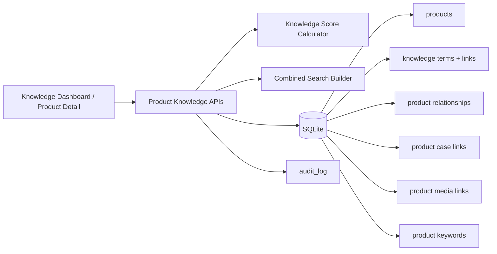
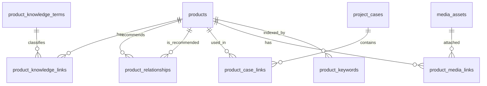

# Module 04 Architecture

## Architecture Changes

Yes. Module 04 adds a normalized knowledge graph layer while retaining the accepted application shell, RBAC, SQLite deployment, SKU system, and foundation dictionaries.

## Relationship Model

## Write Boundary

`PUT /api/products/:id/knowledge` validates all selected IDs against active, authorized option sets and then replaces knowledge links, relationships, cases, media, and keywords inside one `BEGIN IMMEDIATE` transaction. AI-ready scalar fields are updated in the same transaction. An audit event is written after commit.

## Read Boundary

- Product lists receive score and compact knowledge metadata.
- Product detail receives full relations and selectable options.
- Knowledge Dashboard calculates score rankings from current normalized records.
- Combined search uses indexed `EXISTS` lookups rather than denormalized multi-value strings.

## Compatibility

- Module 01 authentication and RBAC remain authoritative.
- Module 02 media and foundation records are reused.
- Module 03 SKU and tag APIs remain backward-compatible.
- No excluded Import, Proposal, CRM, Cloudflare, or AI provider integration was introduced.
